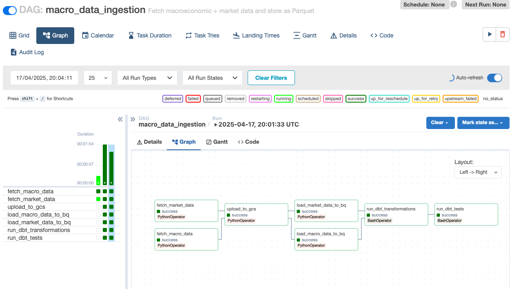

# 📊 Finance Dashboard 2025

This project builds an end-to-end cloud-based data pipeline that ingests macroeconomic and financial market data, processes it using dbt transformations, and visualizes key metrics in a Looker Studio dashboard. The goal is to build a reproducible and scalable pipeline that helps track economic indicators like GDP, CPI, unemployment, and market index performance across multiple countries.

## 🌍 Problem: Understanding Economic Trends Across Countries

Tracking macroeconomic health and market performance across multiple countries is often fragmented, manual, and lacks centralized access. Analysts and decision-makers frequently need to:
- Visit various websites (e.g., World Bank, Yahoo Finance)
- Manually download data
- Perform ad hoc transformations in spreadsheets
- Compare metrics across countries in siloed formats

This project addresses that by providing:
- Automated data ingestion from trusted APIs
- Cloud-native orchestration and transformation using Airflow and dbt
- A centralized dashboard view for cross-country comparisons
- A fully reproducible infrastructure setup using Terraform and Docker

By automating and centralizing this process, the project reduces manual effort, improves reproducibility, and enables consistent, up-to-date analytics.

## 📝 Key features:
- Scheduled data ingestion using Airflow, fetching multiple macro indicators for many countries
- Cleaned and modeled data with dbt
- Partitioned and clustered BigQuery tables to ensure efficient querying
- A dashboard with country and year filters, showing:
	- GDP growth over time
	- CPI trends compared to GDP
	- Correlation between inflation and unemployment
	- Stock market trends from yfinance

This platform enables automated, reproducible macroeconomic analysis, helping users explore country-level trends with data that updates automatically and scales globally.


---

## 🧱 Project Stack

| Component       | Tool/Service                       |
|----------------|------------------------------------|
| Workflow Orchestration | Apache Airflow (Docker)         |
| Data Fetching  | Python Scripts + APIs              |
| Storage        | Google Cloud Storage               |
| Warehouse      | BigQuery                           |
| Transformation | dbt                                |
| Visualization  | Looker Studio                      |
| IaC            | Terraform                          |

---

## 📁 Project Structure

```
├── airflow/                # Airflow setup and DAGs
├── credentials/            # GCP credentials (not committed)
├── data/                   # Raw data (ingested locally)
├── finance_dashboard_dbt/  # dbt models
├── scripts/                # Python data ingestion scripts
├── terraform/              # Terraform infra setup
├── notebooks/              # Helper notebook
├── Makefile                # All useful CLI commands
├── README.md               # Project documentation
└── .env                    # Local environment config
```

---

## 📦 Data Overview

This project pulls macroeconomic and financial market data from two key sources:

🌍 World Bank API (Macroeconomic Indicators)

Pulled for the following indicators and countries:

Indicators:
- NY.GDP.MKTP.CD → GDP (USD)
- FP.CPI.TOTL.ZG → Inflation (%)
- SL.UEM.TOTL.ZS → Unemployment (%)
- FR.INR.RINR → Interest rate (%)

Countries:
- United States (US)
- Germany (DE)
- Japan (JP)
- Poland (PL)
- China (CN)
- Australia
- Canada
- Brasil
- India
- Italy

Volume: ~600 rows per indicator-country combination across 60+ years (1960–2023)

📈 Yahoo Finance API via yfinance (Market Indices)

Downloaded daily close prices for selected country-level indices:
Symbols:
- "US": "^GSPC",  # S&P 500
- "DE": "^GDAXI",  # DAX
- "JP": "^N225",  # Nikkei 225
- "PL": "^WIG20",  # Poland
- "FR": "^FCHI",  # CAC 40
- "GB": "^FTSE",  # FTSE 100
- "IT": "FTSEMIB.MI",  # FTSE MIB (Italy)
- "CN": "000001.SS",  # SSE Composite Index (China)
- "IN": "^BSESN",  # BSE Sensex (India)
- "BR": "^BVSP",  # Bovespa (Brazil)
- "CA": "^GSPTSE",  # S&P/TSX (Canada)
- "AU": "^AXJO",  # ASX 200 (Australia)

Volume: ~20,000 rows across 5 indices, from 2000 to present (daily granularity)

### 📌 Important Note on Data Freshness

⚠️ Disclaimer:
> The data used in this project may not reflect the most recent economic updates.
To ensure full reproducibility and ease of review, only free and open data sources that do not require API keys were used (e.g., World Bank, Yahoo Finance via yfinance).

> While this makes the project easier to run and evaluate, it may limit how up-to-date the metrics are, especially for recent months.

---

## 📊 Pipeline Steps
1. Fetch raw data from APIs
- World Bank API for macroeconomic indicators
- Yahoo Finance (via yfinance) for market indices
2. Save as local Parquet files
- Stored in /data/raw inside the Airflow container
3. Upload to GCS
- Files uploaded to gs://financedashboard-raw-data/raw/ using Google Cloud Storage client
4. Load into BigQuery
- Using BigQuery client with automatic schema detection
5. Transform with dbt
- Stage → Enrich → Final marts
- Includes time-based aggregations and normalization logic
6. Visualize in Looker Studio
- Real-time dashboard showing trends in GDP, inflation, unemployment, and index returns

### 📈 Architecture Diagram

```plaintext
         +----------------+      +--------------------+
         | World Bank API |      |  Yahoo Finance API |
         +--------+-------+      +----------+---------+
                  \                     /
                   \                   /
                    v                 v
               +-----------------------------+
               |      Airflow DAG (ETL)      |
               | fetch, process, upload data |
               +--------------+--------------+
                              |
                              v
                  +-----------------------+
                  |   Google Cloud Storage|
                  |   (raw parquet files) |
                  +-----------+-----------+
                              |
                              v
                  +------------------------+
                  |   BigQuery: raw tables |
                  +-----------+------------+
                              |
                              v
               +-----------------------------+
               |      dbt Transformations     |
               |  staging → marts → metrics   |
               +--------------+--------------+
                              |
                              v
               +-----------------------------+
               |     Looker Studio Dashboard  |
               +-----------------------------+
```

---

## 📋 Prerequisites

- GCP account with billing enabled
  - See [README.md](terraform/README.md) for GCP setup instructions (manual + CLI + Terraform).
- Python 3.10+
- Docker & Docker Compose
- [Poetry](https://python-poetry.org/docs/#installation) - [check how to install](#install-poetry)
- [Terraform](https://developer.hashicorp.com/terraform/install)
- [gcloud CLI](https://cloud.google.com/sdk/docs/install) (optional)
- `make` - [check how to install](#install-make)
- `dbt`

---

## ⚙️ Setup Instructions

```bash
# 1. Clone the repo
git clone https://github.com/tomojpin1234/finance-dashboard-2025.git
cd finance-dashboard-2025

# 2. Initial setup
make init

# 3. Setup GCP (next steps require GCP) more in terraform/README.md

# 4. Set up GCP resources
make tf-init
make tf-apply

# 5. Build and run Airflow
make airflow-init
make airflow-rebuild
make airflow-up         
# wait ~30s and open the browser - this will mean the airflow is ready
make airflow-trigger    # trigger the DAG
# check the pipeline in Airflow UI

# 6. (Optional) Install dependencies
make setup

# 7. (Optional) Run dbt manually
make dbt-run-full
make dbt-test

# Note: the flow was tested on macOS with Intel and Apple silicon
```


> The full pipeline can be triggered from the Airflow UI at `http://localhost:8080` Username: admin, password: admin
> Once triggered, Airflow UI should look like this


---

## ✅ Reproducibility

Use the `Makefile` to run everything:

```bash
🧼 Notebook helpers:
  start-jupyter                    		Install kernel and start Jupyter environment

🧪 Python Data Scripts:
  script-fetch-worldbank-data     		Fetch macroeconomic data from World Bank
  script-fetch-market-indices     		Fetch financial index data via yfinance
  script-upload-to-gcs            		Upload parquet files to GCS
  script-load-to-bigquery-macro-data    Load macro data to BigQuery
  script-load-to-bigquery-market-data   Load market index data to BigQuery

🌀 Airflow Commands:
  airflow-init                     		Initialize Airflow
  airflow-up                       		Start Airflow (via Docker)
  airflow-down                     		Stop Airflow
  airflow-restart                  		Restart Airflow
  airflow-rebuild                  		Rebuild Airflow containers
  airflow-logs                     		View logs for Airflow
  airflow-trigger                  		Manually trigger DAG

☁️ Terraform Commands:
  tf-init                          		Initialize Terraform
  tf-plan                          		Preview Terraform changes
  tf-apply                         		Apply infrastructure changes
  tf-destroy                      		Tear down infrastructure
  tf-output-key                    		Output GCP service account key

🧱 DBT Commands:
  dbt-run                         		Run DBT models
  dbt-run-full                     		Run DBT with --full-refresh
  dbt-test                         		Run DBT tests
  dbt-debug                        		Debug DBT connection

🧹 Utility:
  clean                            		Clean data directories
  setup                            		Install Poetry dependencies
  init                             		Create necessary folders
  reformat                         		Autoformat code with isort and black
```

---

## 📊 Dashboard

- Built in **Looker Studio**
- Uses final tables from `mart_*` dbt models

🔗 Dashboard URL: [link-to-looker-studio](https://lookerstudio.google.com/reporting/7f55694a-f9f3-48d6-9bde-90ead3f8db7e)

---

## 🚀 Potential Next Steps

- CI/CD Deployment to VM via SSH + Git Pull
  - Set up automated deployment from GitHub to the VM using GitHub Actions or Cloud Build.
  - This would ensure that whenever code is updated, the VM pulls the latest changes and restarts Airflow if needed.
- Airflow Logs Sync to GCS
  - Configure Airflow to send task logs to a Cloud Storage bucket, making logs persistent, centralized, and easy to explore/debug outside the container.
- Add Docker Health Checks
  - Introduce container-level health checks to monitor Airflow services (webserver, scheduler) and ensure they’re restarted on failure.
- Scheduled DAG Trigger on GCP (Weekly)
  - Use Cloud Scheduler or rely on Airflow’s native schedule_interval to run the pipeline weekly with GCP-managed triggers.
- Move Dashboard to Dash (Plotly)
  - Migrate the Looker Studio dashboard to a custom Dash app for full flexibility and interactivity.
  - This enables better filtering, customized layouts, and embedding the dashboard as a web app.
- Deploy Dashboard on Cloud Run
  - Once the Dash app is built, deploy it serverlessly using Cloud Run for scalability and simplicity—no need to manage infrastructure.
- Add New Data Sources
  - Extend the project to include:
	- Interest rates from central banks
	- Sentiment analysis from financial news
	- Exchange rates from currency APIs
	- Alternative data (e.g., Google Trends)
- Add Historical or Real-Time Streaming Data (Kafka / PubSub)
  - Introduce stream ingestion for live macro or market data, moving towards a near real-time analytics dashboard.
- Replace Airflow VM with Cloud Composer or Cloud Run Job
  - Consider replacing the self-managed Airflow setup with Cloud Composer (GCP-managed Airflow)
or simplify further using Cloud Run Jobs if DAG complexity is manageable.
- Enable User-Based Access Control (Looker or Dash Auth)
  - Secure the dashboard by enabling authentication for different users (e.g., investor, economist)
with role-based access to data or filters.
- Benchmark GCP Costs and Optimize
  - Use Cloud Monitoring and BigQuery job statistics to identify performance or cost bottlenecks
  - and apply partitioning, clustering, or table expiration policies where needed.

---


## 📝 How to

### Install Make
#### On Linux
- `make` is usually pre-installed on most Linux distributions.
- If not, you can install it via the package manager:
        - Debian/Ubuntu: `sudo apt install make`
        - Fedora/RHEL/CentOS: `sudo dnf install make` (or `yum` on older versions)
#### On macOS
- `make` is generally included with the Xcode Command Line Tools.
- If it’s missing, install Xcode Command Line Tools by running:        
    
        xcode-select --install

#### On Windows
- Make is not natively available on Windows.
- Options for installing make on Windows include:
  - Git Bash: Install Git for Windows, which includes Git Bash and comes with make. You can run make from Git Bash.
  - Chocolatey: If you use Chocolatey, you can install make with:
            
        choco install make

  - WSL (Windows Subsystem for Linux): Installing WSL allows you to run a Linux environment on Windows, where make can be installed as usual.

After installation, you can verify that make is accessible by running:

        make --version

### GCP Setup
See [`README.md`](terraform/README.md) for:
- Manual setup via Google Cloud Console UI
- Automated setup via `gcloud` CLI commands + `terraform`        


#### Install Poetry
To install or update Poetry to the latest version, run:

```bash
curl -sSL https://install.python-poetry.org | python3 -
poetry --version
```

After installation, verify the Poetry version:
This project requires **Poetry 2.0.0 or later**.